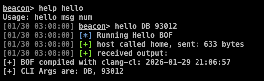

# CS-BOF-TEMPLATE

[](https://www.buymeacoffee.com/whokilleddb)

A dockerized tempalte for building Cobalt Strike BOF using the `clang-cl` compiler! 

## Useful MACROS

Here are a bunch of headers which people might find useful:

| Macro | Header File | Description | 
| ------|--------------|-------------|
| PRINT | `dbgprint.h` | An alias to `BeaconPrintf(CALLBACK_OUTPUT)` | 
| EPRINT | `dbgprint.h` | An alias to `BeaconPrintf(CALLBACK_ERROR)` | 
| DBG | `dbgprint.h` | Prints the current line number of the given file - useful for debugging |
| ERR_PRINT | `dbgprint.h` | Calls `GetLastError()` and prints the return code |

I would recommend going through `dbgprint.h` and `usermacros.h` for a better understanding of the macros and see other useful macors. 

_PS: The macros are there because in the future, I want to extend the BOFs to support other C2s and macros come in handy there._

## Building BOFs

To compile a BOF, update the `src/hello.cc` file or the `Makefile` to reflect the necessary changes and then type:

```
$ docker-compose up --build
```

This would install `clang-cl` and fetch the necessary headers using [xwin](https://github.com/Jake-Shadle/xwin) and compile the BOF and place it in the `output` directory along with any associated scripts. The compilation process will also use the [boflint.py](https://github.com/Cobalt-Strike/bof-vs/blob/main/BOF-Template/utils/boflint.py) script to create a `.lint` file which people are encouraged to go through before firing the BOF off. An empty file represents that your BOF is good to go. 

## Examples 



-----

Thanks to [Steve](https://x.com/0xTriboulet) on Twitter for the inspiration! 